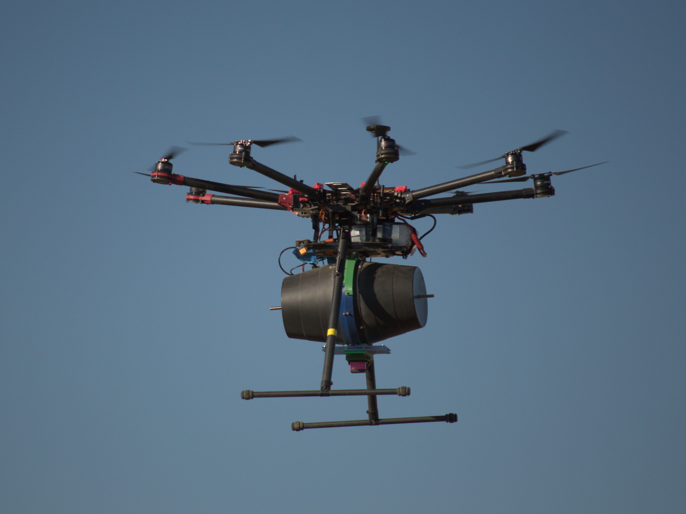

# uav_control
## Chance Constrained Model Predictive Control



## 1. Introduction
Chance constrained MPC for unmanned aerial vehicle flight control with consideration of wind speed and direction. This MPC is intended to be used with a dispersion model identified through flight experiments. The model predicts the distribution of vermiculite dispensed from a hovering drone given the drone’s movement state, wind condition, and dispenser setting.

The video of our experiment is available on YouTube (click):

[](https://www.youtube.com/watch?v=st_apuEBtJg)


## 2. Requirement
This code has only been tested on **Ubuntu 20.04** with **ROS Noetic**. ROS2 currently is not supported.

## 3. Installation
#### Please follow these steps to install ROS:
**Step 1**. Setup your computer to accept software from packages.ros.org.
```
sudo sh -c 'echo "deb http://packages.ros.org/ros/ubuntu $(lsb_release -sc) main" > /etc/apt/sources.list.d/ros-latest.list'
```

**Step 2**. Set up your keys.
```
sudo apt install curl # if you haven't already installed curl
curl -s https://raw.githubusercontent.com/ros/rosdistro/master/ros.asc | sudo apt-key add -
```

**Step 3**. First, make sure your Debian package index is up-to-date.
```
sudo apt update
```
Now install the ROS:
```
sudo apt install ros-noetic-desktop-full
```

**Step 4**. You must source this script in every bash terminal you use ROS in. 
```
source /opt/ros/noetic/setup.bash
```

**Step 5**. To install this tool and other dependencies for building ROS packages, run:
```
sudo apt install python3-rosdep python3-rosinstall python3-rosinstall-generator python3-wstool build-essential
```

**Step 6**. Install `rosdep` and initialize `rosdep`.
```
sudo apt install python3-rosdep
sudo rosdep init
rosdep update
```

## 4. Publication
Na Ma, Anil Mantri, Graham Bough, Ayush Patnaik, Siddhesh Yadav, Christian Nansen and Zhaodan Kong, [**Data-Driven Vermiculite Distribution Modelling for UAV-Based Precision Pest Management**](https://www.frontiersin.org/articles/10.3389/frobt.2022.854381/full), *Frontiers in Robotics and AI*.

Na Ma, Anil Mantri, Graham Bough, Ayush Patnaik, Siddhesh Yadav, Christian Nansen and Zhaodan Kong, Data-Driven Vermiculite Distribution Modelling for UAV-Based Precision Pest Management, Frontiers in Robotics and AI.

```
@article{10.3389/frobt.2022.854381,
  title={Data-driven vermiculite distribution modelling for UAV-based precision pest management},     
  author={Ma, Na and Mantri, Anil and Bough, Graham and Patnaik, Ayush and Yadav, Siddhesh and Nansen, Christian and Kong, Zhaodan},
  journal={Frontiers in Robotics and AI},      
  volume={9},           
  year={2022},       
  url={https://www.frontiersin.org/articles/10.3389/frobt.2022.854381},       
  doi={10.3389/frobt.2022.854381}
}
```

## 5. Acknowledgements
This project is funded by *California Department of Pesticide Regulation*.

## 6. Licence
The source code is released under [GPLv3](http://www.gnu.org/licenses/) license.